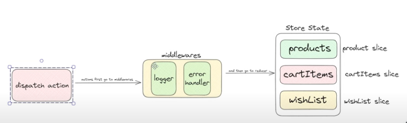

# Javascript Redux


### Why to use ?

- To manage central large state
- It has best practices that guides to write predictable code , so we can debug it easily
- It's tradeoff b/w short term and long term productivity
- Puts state at centralized location outside component tree


### When to use ?

- Large amount of application state
- app updated frequently
- Logic to update state is complex
- Medium to large sized codebase with collaborations


### Redux libraries and tools

- **Redux :** Small standalone JS library
- **React-Redux :** Library to integrate with UI framework (React)
- **Redux Toolkit :** Library contains best practices for better code predictability
- **Redux dev tools extension :** Browser extension to debug code , time travel state etc


### Reasons to not mutate original state :

- It causes bugs, such as the UI not updating properly to show the latest values
- It makes it harder to understand why and how the state has been updated
- It makes it harder to write tests
- It breaks the ability to use "time-travel debugging" correctly
- It goes against the intended spirit and usage patterns for Redux


### Immutable updates

```js
const [state, setState] = useState({ count: 0 });

("// Mutable udpate");
state.count = state.count + 1;
setState(state);

("// Immutable udpate");
setState({ count: state.count + 1 });
```

- Here React sees that `setState()` recieves same previous object and hence not updates state


### Redux State management :


**One way data flow**

- **State :** source of truth that drives app
- **VIew :** declarative description of UI based on current state
- **ACtions :** Event that occurs in app based on user input and triggers state update


### Redux terms and concepts

- Redux is Event driven

- **Actions :**
  - Simple object usually with `type` && `payload` field and used as event
  - `type` tells type of event
  - `payload` tells any data contained in event

```js
const addTodoAction = {
  type: "todos/todoAdded",
  payload: "Buy milk",
};
```


- **Action Creators :**
  - Fn that creates action (so we don't need to write again and again **DRY** principle)

```js
const addTodo = (text) => {
  return {
    type: "todos/todoAdded",
    payload: text,
  };
};
```


- **Reducers :**

  - fn that recieves curr state && action and decides how to update curr state and return single state
  - It's simlar to `arr.reducer((prevState, currState) => {}, initial)` that returns single state
  - **Rules of reducers :**
    - only calculate new state based on currState && action
    - Perform Immutable updates
    - not do async logic, calc random values or other side effects (for better **Predictability**)


- **Store :**
  - Object that contains state, created with reducer (initial state also)

```js
import { configureStore } from "@reduxjs/toolkit";

const store = configureStore({ reducer: counterReducer });

console.log(store.getState());
// {value: 0}
```


- **Dispatch :**
  - Kind of `event emitter` that emits action event to update store

```js
store.dispatch({ type: "counter/increment" });

console.log(store.getState());
// {value: 1}
```


- **Selectors :**
  - fn's that extracts specific part of state from store
  - We need `Seelctors` so UI subscribe to specific part of store only so that it not renders unnecessarily
  - **Try to write selector fun's in slice files and export from there to avoid repeating logic wherever needed**

```js
const selectCounterValue = (state) => state.value;

const currentValue = selectCounterValue(store.getState());
console.log(currentValue);
// 2
```


### Redux Application Data flow ;

- **Initial setup:**
  - A Redux store is created using a root reducer function 
  - Root reducer gets `action` and `prev state` from **root store** as argument
  - The store calls the root reducer once, and gets **Initial state**
  - When the UI is first rendered, UI components access the current state of the Redux store, and use that data to decide what to render. 
  - They also subscribe to any future store updates

- **Updates:**
  - Something happens in the app, such as a user clicking a button
  - The app code dispatches an action to the Redux store, like `dispatch({type: 'counter/increment'})`
  - The store runs the reducer function again with the previous state (from **root store**) and the current action, and saves the return value as the new state
  - The store notifies all parts of the UI that are subscribed that the store has been updated
  - Each UI component that needs data from the store checks to see if the parts of the state they need have changed.
  - Each component that sees its data has changed forces a re-render with the new data, so it can update what's shown on the screen


### Redux basics

```js
import {createStore} from 'redux'

const initialState = {count: 0}

function reducer(state = initialState, action) {
    if(action.type === 'post/increment') return {count: state.count+1}
    if(action.type === 'post/decrement') return {count: state.count-1}
    return state
}

// const store = createStore(reducer, __REDUX_DEVTOOLS_EXTENSION__()) // may throw error if dev tools not present
const store = createStore(reducer, window.__REDUX_DEVTOOLS_EXTENSION__?.())

console.log(store); "// dispatch : f, subscribe : f, getState : f, replaceReducer : f, @@observable: f"
console.log(store.getState()); "// {count: 0}"

const unsubscribe = store.subscribe(()=>{
    console.log(store.getState())
})


store.dispatch({type: 'post/increment'}) "// 1"
store.dispatch({type: 'post/increment'}) "// 2"
store.dispatch({type: 'post/decrement'}) "// 1"

```


### Own Redux Store

- We can have multiple subscribctions so we need to have multiple listeners
- And subscribe returns `unsubscribe` method also

```js
const myCreateStore = (reducer) => {
  let state;
  const listeners = []

  const store = {
    getState: () => state,
    dispatch: (action) => {
      state = reducer(state, action);
      listeners.forEach(listener => listener())
    },
    subscribe: (listener) => {
      listeners.push(listener);

      return ()=>{
        const i = listeners.findIndex(list => list === listener)
        listeners.splice(i,1);
      }
    }
  };

  "// This will catch Initial state from reducer and set state to Initial state"
  store.dispatch({type: '@@INIT'});
  return store;
};


const initialState = {count: 0}

function reducer(state = initialState, action) {
    if(action.type === 'post/increment') return {count: state.count+1}
    if(action.type === 'post/decrement') return {count: state.count-1}
    return state
}

const store = myCreateStore(reducer)

console.log(store); "// dispatch : f, subscribe : f, getState : f, replaceReducer : f, @@observable: f"
console.log(store.getState()); "// {count: 0}"

store.subscribe(()=>{
    console.log(store.getState())
})


store.dispatch({type: 'post/increment'}) "// 1"
store.dispatch({type: 'post/increment'}) "// 2"
store.dispatch({type: 'post/decrement'}) "// 1"

```


### Split && Combine Reducers

`productsSlice` :

```js
const reducer = (state = [], action) => {};

export default reducer;
```

`usersSlice` :

```js
const reducer = (state = [], action) => {};

export default reducer;
```


**How to make own combineReducer :**
- Every time our `rootReducer` is called with provided action 
- For a **root state's** slice, we call it's reducer with provided action and corresponding prev state
- Then we update **root state's** that slice 
- We do this for each slice of **root state**

`store` :
```js
import { combineReducer, createStore } from "redux";

("// We need to return a reducer fn ");
export const myCombineReducer = (reducers) => {
  const reducersKeys = Object.keys(reducers);

  return (state = {}, action) => {
    const nextState = {};

    for(let i=0; i<reducersKeys.length; i++){
      const key = reducerKeys[i];
      const reducer = reducerKeys[key];
      const prevStateOfKey = state[key];
      const nextStateOfKey = reducer(prevStateOfKey, action);
      nextState[key] = nextStateOfKey;
    }

    return nextState;
  };
};

const rootReducer = combineReducer({
  products: productsReducer,
  users: usersReducer,
});

const rootReducer = myCombineReducer({
  products: productsReducer,
  users: usersReducer,
});

const store = createStore(rootReducer);
```


# React Redux 

- It uses `context API` behind the scenes
- Allows React components to interact with a Redux store
- Provides `useSelector(state => state.slice)` && `useDispatch()`
- Wrapping the app with <Provider store={store}> enables all components to use the store


```js 

const StoreContext = createContext()


const Provider = ({store, children}) => {
    
    const [state, setState] = useState(store.getState());

    useEffect(()=> {
        store.subscribe(()=>  setState(store.getState()))
    }, []);
    

    return (
        <StoreContext.Provider value={ state, dispatch: store.dispatch}>
            {children}
        </StoreContext.Provider>
        
    )

}


export const useDispatch = ()=>{
    const store = useContext(StoreContext);
    return store.dispatch
}

export const useSelector = (selector) => {
    const store = useContext(StoreContext);
    return selector(store.state)
}


export default Provider;
```


# Redux RTK


### Creating slices and Root Reducers : 

- **Redux Slices :**
  - A "slice" is a collection of Redux reducer logic and actions for a single feature in your app

```js
import { configureStore } from "@reduxjs/toolkit";
import usersReducer from "../features/users/usersSlice";
import postsReducer from "../features/posts/postsSlice";
import commentsReducer from "../features/comments/commentsSlice";

export default configureStore({
  reducer: {
    users: usersReducer,
    posts: postsReducer,
    comments: commentsReducer,
  },
});
```


- **Root Reducer :**
  - We need to have Root reducer that combines all slice's reducer into one and return single state
  - Redux has `combineReducers` that
  - By default `configureStore` uses `combineReducers` to generate Root reducer

```js
function rootReducer(state = {}, action) {
  return {
    users: usersReducer(state.users, action),
    posts: postsReducer(state.posts, action),
    comments: commentsReducer(state.comments, action),
  };
}
const store = configureStore({
  reducer: rootReducer,
});
```

```js
const rootReducer = combineReducers({
  users: usersReducer,
  posts: postsReducer,
  comments: commentsReducer,
});
```


### Modifying Action Payload

- Either we can generate `id` and pass to dispatch in action object
- Or We can use `prepare` callback inside `createSlice` reducer that allows to modify `action.payload`
  - This is better as component should not worry about generating new Id but at the same time reducers should also not generate side effects
  - `prepare` can take multiple callbacks

```js
// hand-written action creator
function postAdded(title, content) {
  const id = nanoid();
  return {
    type: "posts/postAdded",
    payload: { id, title, content },
  };
}
```


**Using Inbuilt prepare Callback :**
```js
const postsSlice = createSlice({
  name: "posts",
  initialState,
  reducers: {
    postAdded: {
      prepare(title, content) {
        return {
          payload: {
            id: nanoid(),
            title,
            content,
          },
        };
      },
      reducer(state, action) {
        state.push(action.payload);
      },
    },
  },
});
```


### Immer JS library 

- Immer uses `proxy` behind the scenes
- So we can wrap our `reducer`  saate inside `produce` method
```js 
import {produce} from 'immer'

const users = [
    {
        id: "1",
        name: "dev",
        age: 22, 
    },
    {
        id: "2",
        name: "dhruv",
        age: 21, 
    },
]

"// Immutable udpate using Plain JS"
const newUsers1 = users.map((user, i) => {
    if(i==1) return {...user, age:20};
    return user;
})


"// Using Immer JS"
const newUsers2 = produce(users, (usersProxy)=>{
    usersProxy[1].age = 20;
})


const reducer = (originalState, action ) => {
    return produce(originalState, state => {
        switch():
        .... 
    })
}

```


### Creating Slice Reducer And Actions


#### createSlice :

- createSlice takes care of the work of generating **action type strings** (for switch statements), **action creator functions**, and **action objects**
- It also generates the slice reducer function that knows how to respond to all these action types (only inside `createSlice` && `createReducer`)
- Uses `Immer` library to convert mutable state updates to immutable state updates
  - `Immer` is wrapper using `Proxy`

```js
import { createSlice } from '@reduxjs/toolkit'

export const counterSlice = createSlice({
  name: 'counter',
  initialState: {
    value: 0
  },
  reducers: {
    increment: state => {
      "// Redux Toolkit allows us to write 'mutating' logic in reducers. It"
      "// doesn't actually mutate the state because it uses the immer library,"
      "// which detects changes to a 'draft state' and produces a brand new"
      "// immutable state based off those changes"
      state.value += 1
    },
    "// action type : <name>/decrement = counter/decrement"
    decrement: state => {
        state.value -= 1
    },
    "// action type : counter/incrementByAmount"
    incrementByAmount: (state, action) => {
      state.value += action.payload
    }
  }
})

console.log(counterSlice.actions.increment())
// {type: "counter/increment"}

const getNewState = counterSlice.reducer(
  { value: 10 },
  counterSlice.actions.increment()
)
console.log(newState)
// {value: 11}


export const { increment, decrement, incrementByAmount } = counterSlice.actions

export default counterSlice.reducer
```


### Own CreateSlice 


```js 
const myCreateSlice = (config) => {

    const {name, initialState, reducers} = config;

    const actions = {};
    Object.keys(reducers).forEach(reducer => {
        actions[reducer] = (payload) => {
            return {
                type: `${name}/${reducer}`,
                payload,
            }
        }
    })    

    const reducer = (originalState = initialState, action) => { "// action.type = 'posts/addProduct'"
        return produce(originalState, state => {
          const caseReducer = reducers[action.type.split('/')[1]]; "// reducers['addProduct']"
          if(caseReducer) {
            return caseReducer(state, action);
          }
          return state
          })
        }
    
    return {
        reducer,
        actions,
    }
}


const postSlice = myCreateSlice({
    name: "posts",
    initialState : [],
    reducers: {
        addProduct(state, action) {},
        removeProduct(state, action) {},
    }
})

export {addProduct, removeProduct} = postSlice.actions;
export default postSlice.reducer;
```


# Redux Thunk


### Middlewares 
-  Something that extend features (here extends store features)
- Execute extra logic when any action is dispatched (such as logging the action and state)
- Pause, modify, delay, replace, or halt dispatched actions
- Write extra code that has access to dispatch and getState
- Teach dispatch how to accept other values besides plain action objects, such as functions and promises, by intercepting them and dispatching real action objects instead




##### Creating custom Middleware 

- Implemented using currying functions in JS

```js 

const logger = (store) => (next) => (action) => {
    console.log('Store :', store);
    console.log('next :', next);
    console.log('action :', action);
    next(action)
}

export const store = configureStore({

    reducer: {
        products: productsReducer,
    },

    middleware: [logger],


})

```


### Writing Async Logic and Thunks

- **Thunk =>** Delegating task
- We shouldn't write async logic, sideeffects inside redux
- **Middlewares** :
  - So this is middleware that first performs async logic and then dispatches action
  - Out of many async `Redux` middlewares , `redux-thunk` used widely
  - `redux-thunk` needs to be added to Redux store to use thunk fn and `configureStore` automatically adds it
  - Using `redux-thunk` allows `dispatch` to handle async callback (Thunk fn) that gets `dispatch` && `getState` props


**Thunk Action :**

- These callbacks are called `Thunk functions` which are accepted by `dispatch`

```js
store.dispatch(async (dispatch, getState) => {
  try {
    const stateBefore = getState();
    console.log(`Counter before: ${stateBefore.counter}`);

    ("//make an async call in the thunk");

    const user = await userAPI.fetchById(userId);

    ("// dispatch an action when we get the response back");

    dispatch(userLoaded(user));

    const stateBefore = getState();
    console.log(`Counter before: ${stateBefore.counter}`);
  } catch (err) {
    ("// If something went wrong, handle it here");
  }
});
```


**Thunk Action cretaor**

- We can export this fun to use it as async action creator wherever needed

```js
export const incrementAsync = (amount) => async (dispatch, getState) => {
  try {
    ("//make an async call in the thunk");
    const user = await userAPI.fetchById(userId);
    ("// dispatch an action when we get the response back");
    dispatch(userLoaded(user));
  } catch (err) {
    ("// If something went wrong, handle it here");
  }
};

store.dispatch(incrementAsync(5));
```


### Outside Actions

- To catch actions outside of slice i.e. any other pattern than `<name>/<reducer>` we can use `extraReducers`
- `extraReducers` is callback that recieves `builder` prop where we can chain :
  - `addCase(<action type>, reducer)` : activates when matches `<action type>`
  - `addMatcher(matcher, reducer)` : matches when matcher returs true
  - `addDefaultCase()` : matches by default (where no other is defined)
- If multiple matches then runs in order defined

```js
const postsSlice = createSlice({
  name: 'posts',
  initialState,
  reducers: {
    "// slice-specific reducers here"
  },
  extraReducers: builder => {
    builder
      .addCase('counter/decrement', (state, action) => {})
      .addCase(increment, (state, action) => {})
      .addMatcher(matcher, reducer)
      .addDefaultCase(reducer)
  }
})
```


### Using Async Thunk in Redux

- Just like `Promises` we have :
  - event `start` where status is `Pending`
  - event `fulfilled` where status is `Accepted` or `Rejected`
- And `idle` state to only fetch anything for first time

```js
const getPostsPending = () => ({
  type: "posts/fetchPosts/pending",
});

const getPostsSuccess = (posts) => ({
  type: "posts/fetchPosts/success",
  payload: posts,
});

const getPostsFailed = (error) => ({
  type: "posts/fetchPosts/failed",
  error,
});

const fetchPosts = () => async (dispatch) => {
  dispatch(getPostsPending());
  try {
    const posts = await getPosts(url);
    dispatch(getPostsSuccess(posts));
  } catch (err) {
    dispatch(getPostsFailed(err.toString()));
  }
};
```


### Using Async Thunk in Redux RTK

- Instead of manually dispatching `Pending` , `Success` , `Failed` actions , RTK provides method to abstract away this logic
- It provides `createAsyncThunk` that contains :
  - **prefix string** for action to be generated by async thunk and
  - **Payload creator** callback that returns Fulfilled Promise with data or Rejected Promise with error
- `createAsyncThunk` automatically dispatches :

  - `<pefix string>/pending` action initially
  - `<pefix string>/fulfilled` action, if fulfilled promise is returned
  - `<pefix string>/rejected` action, if rejected promise is returned

- `createAsyncThunk` generates action types `<thunk>.pending`, `<thunk>.fulfilled`, `<thunk>.rejected` to be used in catching in `extraReducers`
- `createAsyncThunk` RTK adds `unwrap()` method to returned promise which returns Fulfilled pomise with payload or Rejected promise with error , so that we can use try and catch to handle states locally (instead of creating states separately globally)

```js
import { createAsyncThunk } from '@reduxjs/toolkit'


export const fetchPosts = createAsyncThunk('posts/fetchPosts', async () => {
  const response = await client.get(url)
  return response.data
})


const postsSlice = createSlice({
  name: 'posts',
  initialState,
  reducers: {
    "// existing reducers here"
  },
  extraReducers(builder) {
    builder
      .addCase(fetchPosts.pending, reducer)
      .addCase(fetchPosts.fulfilled, reducer)
      .addCase(fetchPosts.rejected, reducer)
  }
})
```


### Thunk Arguments

```js
import { createAsyncThunk } from '@reduxjs/toolkit'


export const fetchPosts = createAsyncThunk('', async ( data,
    "// thunkAPI "
    {
      getState,
      dispatch,
      extra,
      requestId,
      signal,
      rejectWithValue,
  }) => {


})


dispatch(fetchPosts(data))
```


# Optimizations

### Problem with selectors

- Here `allPosts.filter()` returns a reference so `useSelector` returns new array always
- Therefore it re-renders unnecessarily

```js
const posts = useSelector((state) => {
  const allPosts = selectAllPosts(state);
  const userPosts = allPosts.filter((post) => post.author === userId);
  return userPosts;
});
```

### Memoized Selectors

- Avoid creating new object/array references inside of useSelector

  - those will cause unnecessary re-renders
  - useSelector can accept an alternate comparison function like shallowEqual instead of reference equality

- `Reselect` is library for creating memoized selector funs spcially designed to be used with Redux which automatically comes with `Redux tool kit`
- `createSelector` is used to create memoized selector
- value returned by input selectors will be used as dependency and also as input to final output selector's callback
- Below code only re-runs when v1 || v2 changes

```js
export const selectPostsByUser = createSelector(
  [f1, f2], "//list of input selectors that returns v1 && v2 respectively"
  (v1, v2) => {} , "//output selector"
)
```

### Problem with LIST component

- Since `<List>` is subscribed to array of posts ,
- So change in 1 `<PostExercept>` component returns new reference of posts
  - Since `Immer` behind the scene does immutable updates so new ref returned
- This re-renders all `<PostExercept>` cmponents inside `<List>`

- **Solution 1** :

  - Use `React.memo()` to export `<PostExercept>` component that only re-renders if any change in `props`

- **Solution 2** :

  - Fetch `postId's` inside `<List>` using memoized selector
  - Send `<PostExercept>` a `postId` prop so that `<PostExercept>` is subscribed to only post object
  - Now even if posts is changed but `<List>` won't changed as list of postId's are same
    - But now we need to sort posts in reducer

- **Solution 3** :
  - Normalize Data

# Normalizing data

**Lookup table :**

- Similar to `Hash maps` , reduces searching time

```js
"// Takes O(n) time to find ";
const array = [
  { id: 1, name: "Dev" },
  { id: 2, name: "Kunal" },
  { id: 3, name: "Dhruv" },
];

("// Takes O(1) time to find");
const array = {
  1: { id: 1, name: "Dev" },
  2: { id: 3, name: "Kunal" },
  3: { id: 4, name: "Dhruv" },
};
```

**De-Normalized Data :**

- Deeply Nested table

```js
const blogPosts = [
  {
    id: 'post1',
    author: { username: 'user1', name: 'User 1' },
    body: '......',
    comments: [
      {
        id: 'comment1',
        author: { username: 'user2', name: 'User 2' },
        comment: '.....'
      },
      {
        id: 'comment2',
        author: { username: 'user3', name: 'User 3' },
        comment: '.....'
      }
    ]
  },
 {
    id: 'post2',
    author: { username: 'user2', name: 'User 2' },
    body: '......',
    comments: [
      {
        id: 'comment3',
        author: { username: 'user3', name: 'User 3' },
        comment: '.....'
      },
      {
        id: 'comment4',
        author: { username: 'user1', name: 'User 1' },
        comment: '.....'
      },
    ]
  }
"// many more "
]
```

**Normalized Data :**

- Basically every nested object is fetched outside and made separated look up table
- And refrences are used instead of copying objects directly there

```js
  posts : {
      allIds : ["post1", "post2"],
      entity : {
          "post1" : { id : "post1", author : "user1", body : "......", comments : ["comment1", "comment2"] },
          "post2" : { id : "post2", author : "user2", body : "......", comments : ["comment3", "comment4"] }
      },
  },
  comments : {
      allIds : ["comment1", "comment2", "comment3", "comment4"],
      entity : {
          "comment1" : { id : "comment1", author : "user2", comment : ".....",},
          "comment2" : { id : "comment2", author : "user3", comment : ".....",},
          "comment3" : { id : "comment3", author : "user3", comment : ".....",},
          "comment4" : { id : "comment4", author : "user1", comment : ".....",},
      },
  },

users : {
    allIds : ["user1", "user2", "user3"],
    entity : {
        "user1" : {username : "user1",name : "User 1",},
        "user2" : {username : "user2",name : "User 2",},
        "user3" : {username : "user3",name : "User 3",}
    },
}
```

### Normalized State Structure

- **Normalization** means :

  - No duplication (so we used refrences and make each entity a separate lookup table)
  - Normalized data is kept in lookup table
  - Array of all ID's are also present (sequenced or non sequenced)

- **De normalize data** drawbacks :
  - If we make change in `comment` then it's corresponding `post` will also mutate and causes unwanted renders
  - Nested objects required nested reducers

### Managing Normalized state with `createEntityAdapter`

- Include options obj with `sortComparer` to sort `entities` as desired
- Provides way to create Normalized data using `getInitialState()` method : `{ids: [], entities: {}}`
- Provides common reducer functions like `addMany`, `addOne`, `updateMany`, `upsertMany` etc. [Reference](https://redux-toolkit.js.org/api/createEntityAdapter#crud-functions)
- Provides `getSelectors()` method for common selectors

```js
const postsAdapter = createEntityAdapter({
  sortComparer: (a, b) => b.date.localeCompare(a.date),
});

("//Extra states passed inside");
const initialState = postsAdapter.getInitialState({
  status: "idle",
  error: null,
});

postsAdapter.upsertMany(state, action.payload);

("// Pass in a selector that returns the posts slice of state");
export const { selectAll: selectAllPosts, selectById: selectPostById } =
  postsAdapter.getSelectors((state) => state.posts);
```
