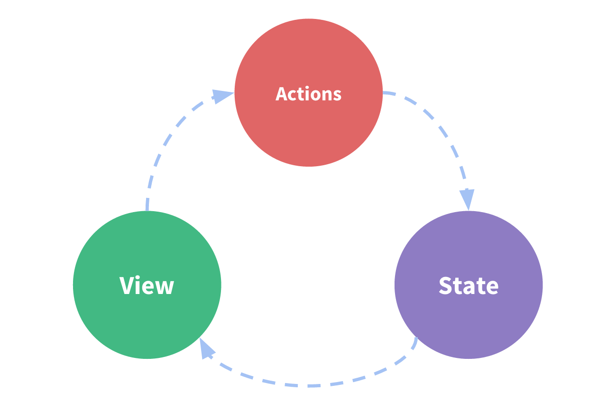

# Redux 


### Why to use ?
- To manage central large state
- It has best practices that guides to write predictable code , so we can debug it easily 
- It's tradeoff b/w short term and long term productivity
- Puts state at centralized location outside component tree


### When to use ?
- Large amount of application state
- app updated frequently
- Logic to update state is complex
- Medium to large sized codebase with collaborations


### Redux libraries and tools 
- **Redux :** Small standalone JS library
- **React-Redux :** Library to integrate with UI framework (React)
- **Redux Toolkit :** Library contains best practices for better code predictability
- **Redux dev tools extension :** Browser extension to debug code , time travel state etc


### Reasons to not mutate original state :
- It causes bugs, such as the UI not updating properly to show the latest values
- It makes it harder to understand why and how the state has been updated
- It makes it harder to write tests
- It breaks the ability to use "time-travel debugging" correctly
- It goes against the intended spirit and usage patterns for Redux


### Redux terms and concepts

#### State management :

**One way data flow**
  - **State :** source of truth that drives app
  - **VIew :** declarative description of UI based on current state
  - **ACtions :** Event that occurs in app based on user input and triggers state update


#### Terminology :

- Redux is Event driven 

- **Actions :** 
  - Simple object usually with `type` && `payload` field and used as event
  - `type` tells type of event  
  - `payload` tells any data contained in event
  
```js
const addTodoAction = {
  type: 'todos/todoAdded',
  payload: 'Buy milk'
}
```


- **Action Creators :**
  - Fn that creates action (so we don't need to write again and again **DRY** principle)
```js
const addTodo = text => {
  return {
    type: 'todos/todoAdded',
    payload: text
  }
}
```


- **Reducers :**
  - fn that recieves curr state && action and decides how to update curr state and return single state 
  - It's  simlar to `arr.reducer((prevState, currState) => {}, initial)` that returns single state
  - **Rules of reducers :**
    - only calculate new state based on currState && action
    - Perform Immutable updates 
    - not do async logic, calc random values or other side effects (for better **Predictability**)


- **Store :**
  - Object that contains state, created with reducer (initial state also)

```js
import { configureStore } from '@reduxjs/toolkit'

const store = configureStore({ reducer: counterReducer })

console.log(store.getState())
// {value: 0}
```

- **Dispatch :**
  - Kind of `event emitter` that emits action event to update store

```js 
store.dispatch({ type: 'counter/increment' })

console.log(store.getState())
// {value: 1}
```


- **Selectors :**
  - fn's that extracts specific part of state from store
  - We need `Seelctors` so UI subscribe to specific part of store only so that it not renders unnecessarily 
```js 
const selectCounterValue = state => state.value

const currentValue = selectCounterValue(store.getState())
console.log(currentValue)
// 2
```


- **Redux Slices :**
  - A "slice" is a collection of Redux reducer logic and actions for a single feature in your app
```js
import { configureStore } from '@reduxjs/toolkit'
import usersReducer from '../features/users/usersSlice'
import postsReducer from '../features/posts/postsSlice'
import commentsReducer from '../features/comments/commentsSlice'

export default configureStore({
  reducer: {
    users: usersReducer,
    posts: postsReducer,
    comments: commentsReducer
  }
})
```

- **Root Reducer :**
  - We need to have Root reducer that combines all slice's reducer into one and return single state
  - Redux has `combineReducers` that 
  - By default `configureStore` uses `combineReducers` to generate Root reducer
```js
function rootReducer(state = {}, action) {
  return {
    users: usersReducer(state.users, action),
    posts: postsReducer(state.posts, action),
    comments: commentsReducer(state.comments, action)
  }
}
const store = configureStore({
  reducer: rootReducer
})
```

```js
const rootReducer = combineReducers({
  users: usersReducer,
  posts: postsReducer,
  comments: commentsReducer
})
```


### Redux Application Data flow ;

- **Initial setup:**
  - A Redux store is created using a root reducer function
  - The store calls the root reducer once, and gets **Initial state** 
  - When the UI is first rendered, UI components access the current state of the Redux store, and use that data to decide what to render. They also subscribe to any future store updates


- **Updates:**
  - Something happens in the app, such as a user clicking a button
  - The app code dispatches an action to the Redux store, like `dispatch({type: 'counter/increment'})`
  - The store runs the reducer function again with the previous state and the current action, and saves the return value as the new state
  - The store notifies all parts of the UI that are subscribed that the store has been updated
  - Each UI component that needs data from the store checks to see if the parts of the state they need have changed.
  - Each component that sees its data has changed forces a re-render with the new data, so it can update what's shown on the screen


### Creating Slice Reducer And Actions 

#### createSlice :
- createSlice takes care of the work of generating **action type strings** (for switch statements), **action creator functions**, and **action objects**
- It also generates the slice reducer function that knows how to respond to all these action types (only inside `createSlice` && `createReducer`)
- Uses `Immer` library to convert mutable state updates to immutable state updates
  - `Immer` is wrapper using `Proxy`

```js 
import { createSlice } from '@reduxjs/toolkit'

export const counterSlice = createSlice({
  name: 'counter',
  initialState: {
    value: 0
  },
  reducers: {
    increment: state => {
      // Redux Toolkit allows us to write "mutating" logic in reducers. It
      // doesn't actually mutate the state because it uses the immer library,
      // which detects changes to a "draft state" and produces a brand new
      // immutable state based off those changes
      state.value += 1
    },
    "// action type : <name>/decrement = counter/decrement"
    decrement: state => {
        state.value -= 1
    },
    "// action type : counter/incrementByAmount"
    incrementByAmount: (state, action) => {
      state.value += action.payload
    }
  }
})

console.log(counterSlice.actions.increment())
// {type: "counter/increment"}

const getNewState = counterSlice.reducer(
  { value: 10 },
  counterSlice.actions.increment()
)
console.log(newState)
// {value: 11}


export const { increment, decrement, incrementByAmount } = counterSlice.actions

export default counterSlice.reducer
```


### Writing Async Logic and Thunks 
- **Thunk =>** Delegating task
- We can't do async logic, sideeffects inside redux 
- So this is middleware that first performs async logic and then dispatches action
- `redux-thunk` middleware needs to be added to Redux store to use thunk, `configureStore` automatically adds it
- Using `redux-thunk` allows `dispatch` to handle async callback that gets `dispatch` && `getState` props


- **Thunk Action :**
```js 
store.dispatch( async (dispatch, getState) => {
    try {
      "//make an async call in the thunk"
      const user = await userAPI.fetchById(userId)
      "// dispatch an action when we get the response back"
      dispatch(userLoaded(user))
    } 
    catch (err) {
      "// If something went wrong, handle it here"
    }
} )
```

- **Thunk Action cretaor**
  - We can export this fun to use it as async action creator wherever needed
```js 
export const incrementAsync = (amount) => async (dispatch, getState) => {
    try {
      "//make an async call in the thunk"
      const user = await userAPI.fetchById(userId)
      "// dispatch an action when we get the response back"
      dispatch(userLoaded(user))
    } 
    catch (err) {
      "// If something went wrong, handle it here"
    }
} 

store.dispatch(incrementAsync(5));

```


### React-Redux
- Allows React components to interact with a Redux store
- Provides `useSelector(state => state.slice)` && `useDispatch()`
- Wrapping the app with <Provider store={store}> enables all components to use the store


